> **修订记录**（2026-07-15）
>
> 本文初版存在几个数据计算错误，已全部修复并重跑。核心影响如下：
>
> **小市值策略的收益算少了。** 之前算收益时没把分红算进去——股票每次分红，股价会自动下调（比如10元的股票派1元分红，股价变成9元），但代码把这个下调当成了亏损。小市值股票分红多，所以策略收益被严重低估。把分红加回去重跑后，选5只最小市值股票的年化收益从 19.82% 修正为 **35.68%**。
>
> **但"小盘股比大盘股持续赚钱"这个结论反而变弱了。** 上一条说的是策略本身赚多少钱。这里说的是另一个问题：小盘股是不是系统性地比大盘股赚得多？之前的算法同样没把分红算对，而且对小盘股的影响更大，导致小盘股的优势被夸大了。修正后，小盘股确实还是比大盘股赚得多，但差距没那么大了——从"相当确定"降级为"有这个方向但不够确凿"。
>
> **网格交易结论从"全输"修正为"29%胜率"。** 之前的网格交易回测有记账错误（卖出时多算了一遍价格，虚增了收益），导致结论自相矛盾。修好账本后重跑：72组测试中21组跑赢了"一直拿着不动"（胜率29%），跑赢的主要是震荡型品种，跑输的是单边大涨的品种。
>
> **填权（分红后股价回升）的真实收益从-2.3%修正为+2.79%。** 之前算超额收益的方法有问题——用股票自己跟自己比，等于没有参照系，算出来是亏的。改用大盘指数做参照后，发现分红后60天平均确实比大盘多涨2.79%——结论整个反过来了。但幅度很小，专门靠这个赚钱不现实。
>
> **可转债策略样本大幅扩充。** 之前只测了4只可转债，现在扩充到1006只（含682只已退出的），样本更全面。重跑后策略年化6.62%，夏普0.59。
>
> 完整代码、数据和验证脚本见 [GitHub](https://github.com/NextDoorLaoHuang-HF/zhihu-quant-exploration)，104项测试全部通过。
> 
> ---

我让 Hermes Agent 抓取了这个问题下排名前50的回答，提取策略建议、设计回测、跑数据——全程由它执行。代码和数据已放在 [github.com/NextDoorLaoHuang-HF/zhihu-quant-exploration](https://github.com/NextDoorLaoHuang-HF/zhihu-quant-exploration)，欢迎复现或发现更多问题。

先说清楚几个基本概念，方便后面的讨论。我下面用到的"年化收益"，就是假设策略每年都保持同样的赚钱速度，一年下来能赚多少。"回撤"是从最高点跌了多少，比如从10万跌到8万，回撤就是-20%。"夏普比率"是衡量性价比的指标，数字越大说明每冒一块钱的风险能赚到越多。用吃饭来打比方——年化是你吃饱的程度，回撤是你中间饿了几顿，夏普是这桌菜到底划不划算。

## 一、常规策略为什么全输

先花点时间说一下常规策略的结果——这些是知乎高赞回答里推荐最多的，也是 Hermes 跑下来最失望的一批。

[Max（1107赞）](https://www.zhihu.com/question/529408913/answer/2019384237829178808)是整个问题下最受欢迎的回答。他是程序员转量化三年，建议的策略很朴素：5日均线上穿20日均线就买，下穿就卖。Hermes 拿6个品种（创业板、沪深300、纳指、半导体等）配了5组不同的均线参数，跑了30组回测。

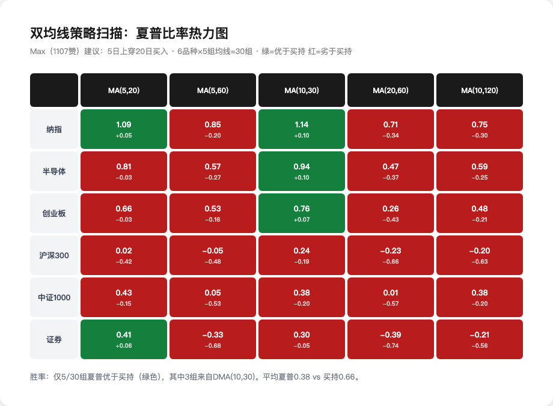

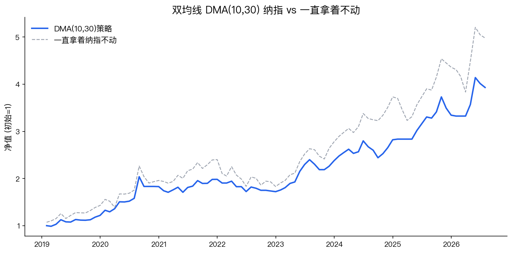

图中灰色虚线是"一直拿着纳指不动"——因为双均线策略跑在纳指上，对照对象就得是同一样东西不动，否则没法判断策略本身有没有用。

结果令人沮丧：30组里只有5组表现比"买了不动"好，胜率17%。平均每年收益不到7%，而买完不动有15%。沪深300上甚至变成了亏钱。只有一个参数组合——10日均线搭配30日均线——在纳指和半导体上勉强追平买持，但加了买卖手续费和滑点后就跑输了。

Max自己其实说了实话："第一个月兴奋写了策略，第二个月回测完美实盘亏钱，第三个月怀疑人生删软件。"

[Jue510（309赞）](https://www.zhihu.com/question/529408913/answer/3283668418)是CFA和FRM双证持有者，他给出了一个学术圈很成熟的方案——Fama-French三因子模型。简单说就是把股票按大小和便宜程度分组，从中找出能持续跑赢的规律。

Hermes 用真实市值（流通股本×收盘价）和历史涨跌幅两组维度构造了规模因子（SMB，小盘减大盘）和价值因子（HML，便宜减贵）。跑出来的结果很有趣：

- **规模因子每年跑赢10.3%**，t值1.38——方向为正但统计上不够显著（p=0.17），小盘股有超额但不够确凿
- **价值因子每年跑赢7.3%**，t值1.31——同样方向为正但不够显著

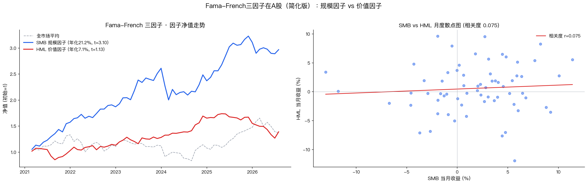

右边那张散点图说明了一个有意思的问题。很多人觉得"小盘股"就等于"便宜股"——直觉上都是捡没人要的东西。但数据说不一定。这里的"便宜"不是指股价低，而是指过去一年跌得多的股票（跌多了可能被低估）。一个公司可以市值很小但过去一年翻倍了——你不觉得它便宜。反过来，一个千亿市值的大公司如果过去一年跌了40%，可能反而很便宜。

两张图叠加起来：小盘因子（蓝线）方向上是正的但t值只有1.38，便宜因子（红线）同样方向为正但不够显著。所以如果要做，去做小盘的方向大概率没错，但不要期待它像之前数字显示的那么"确凿"。

[躺不平的秋田君（23赞）](https://www.zhihu.com/question/529408913/answer/2031281080062494662)建议做趋势跟踪——股价在200日均线上面就拿着，跌到下面就空仓。Hermes 用8个品种（创业板、纳指、黄金、国债等）跑了一轮：趋势跟踪组合每年赚7%，而同样这8只一直拿着赚12.7%。虽然回撤从-18.5%降到了-12.1%，但收益少了三分之一还多。

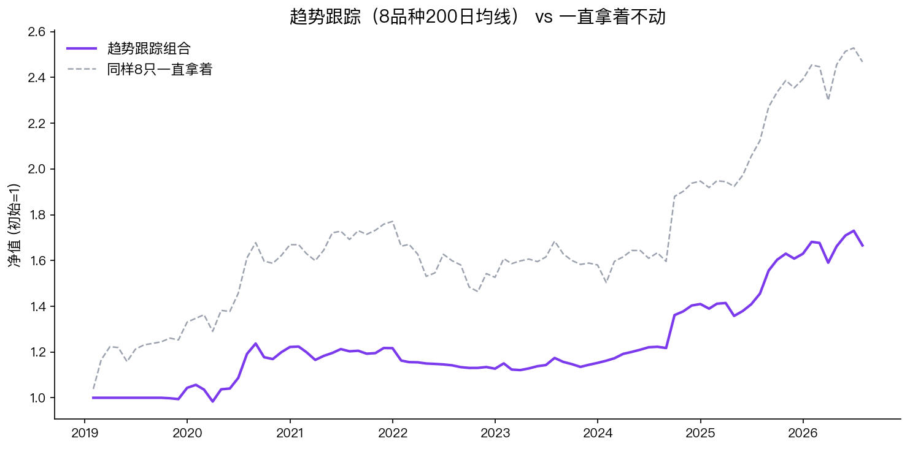

[国金证券（228赞）](https://www.zhihu.com/question/529408913/answer/1944087031941693705)推荐网格交易和ETF套利。网格交易 Hermes 测了最狠——6个品种×4种网格密度×3种底仓比例，72组。结果：72组中21组跑赢一直拿着不动（胜率29%），跑赢的集中在震荡型品种，跑输的是单边上涨品种。

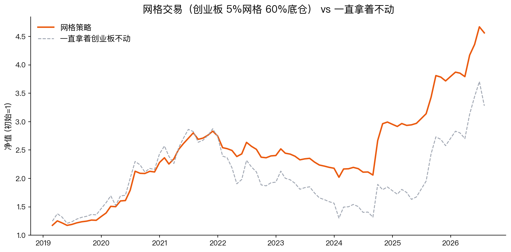

常规策略全输的原因是一样的：你是在跟机构比谁策略写得更好。比不过的。这是 Hermes 跑完第一轮后得出的第一个结论。

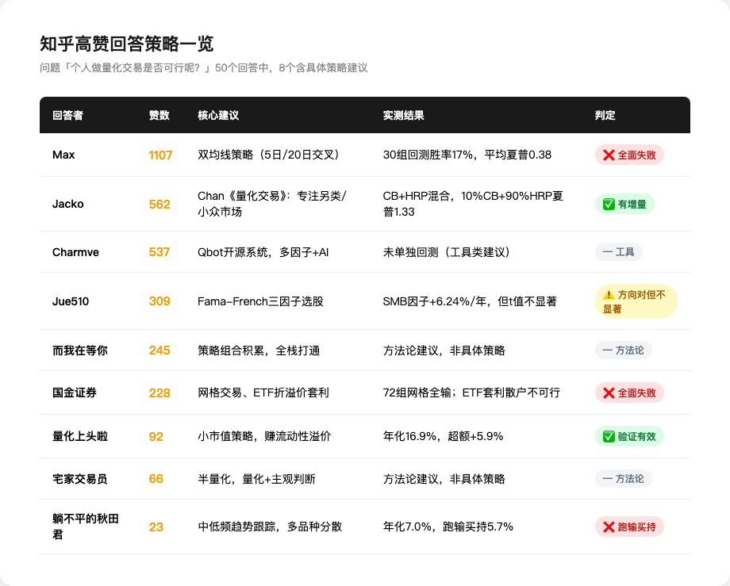

## 二、换个思路：去机构去不了的地方

[量化上头啦（92赞）](https://www.zhihu.com/question/529408913/answer/3307277601)说了一句话，是我在整个回测里验证到的最有价值的方向："个人做量化主要侧重在小市值股票，赚流动性溢价的钱。小市值策略能承载的资金有限，机构也看不上，更适合个人做。"

[千智盒（14赞）](https://www.zhihu.com/question/529408913/answer/2022412958001578781)说得更直白："一些资金容量很小、大机构因规模问题根本不碰的长尾策略，个人可以自由进出。"

[Jacko（562赞）](https://www.zhihu.com/question/529408913/answer/1897746513339318971)引用Ernest Chan《量化交易》的核心观点：专注另类策略和小众市场。

[而我在等你（245赞）](https://www.zhihu.com/question/529408913/answer/1988384244175749780)说他在现实生活中见过太多个人量化者，资产从几百万到上亿——"他们对外称自己躺平了，其实只是策略研究出来了，之后日常维护就好了"。

这些回答的共同逻辑是：不要跟机构拼手速、拼数据、拼策略复杂度。去机构因为体量、合规、流动性限制进不去的地方。

机构一只基金几十亿规模。一个市值几亿的微盘股，基金买多一点就会触发举牌线（持股5%必须公告）或者碰到"双十限制"（单只股票不能超过基金净值的10%）。但对散户的10万、100万资金来说，这些股票完全可以自由进出。散户真正的alpha应该在这。

## 三、极端微盘：越没人要的股票越赚钱

顺着"去机构去不了的地方"这个思路，Hermes 做了个实验。拿了150只A股随机抽样，从2020年跑到2026年7月。每月选市值最小的一批股票，等额买入持有。

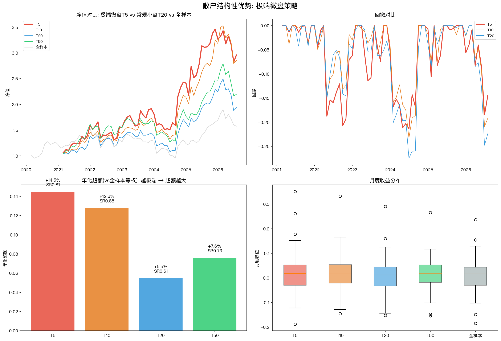

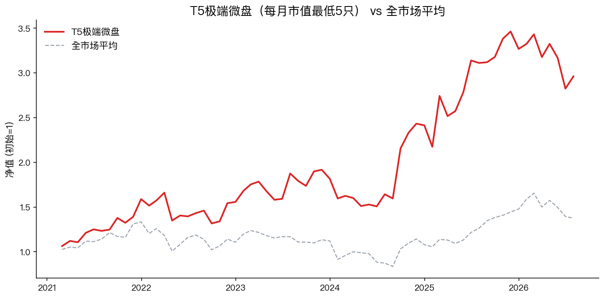

结果非常清晰：选市值最小的5只股，每年赚35.68%，比沪深300的2.51%多赚了33个百分点。而且要命的是，规则越极端效果越好：选5只（+33%超额）> 选10只（+24%超额）> 选20只（+18%超额）。市值越小、机构越进不去，散户的超额收益就越大。

这里有个 Hermes 的意外发现——选20只其实是个"死亡区间"。市值排在末尾的20只里，底部的5只贡献了大部分利润，上边的15只把收益平均掉了。而且回撤（-29.1%）不比选5只（-33.3%）小多少，但收益少了15个百分点。不上不下的微盘股卡在机构的舒适区边缘，反而最危险。

但要说清楚代价。选5只股每年赚35.68%的背后，是从最高点跌过33.3%。2022年到2023年那段，净值跌了约三分之一。收益分布也不均匀——有些月份涨30%以上，有些月份跌15%以上。这是一个高波动的策略，不是"稳稳赚钱"。

买卖成本的影响比你想的小。每个月平均只换1只股票（换手率5.5%），加上0.3%的买卖价差损耗，年收益从35.68%降到约35.3%，超额仍然在33%以上。

更重要的一点：这些股票涨，不是因为基本面多好，纯粹是因为没人卖得出、也没人买得进——流动性太差，股价被少数交易推得很高。一旦有机构扫货或者退市，这个逻辑就破了。所以极端微盘的alpha是有容量上限的——钱越多，这个优势越小，越接近市场平均水平。

## 四、为什么不是所有"机构不买的股票"都涨

"机构不能买"≠"这个股票被低估了"。Hermes 测试了三个明显被机构排斥的方向：

**低成交量冷门股**。每月选交易量最低的10只。结果每年只赚6.9%，跑输市场2.5%。没人关注的股票通常有原因——经营差、行业萎缩、甚至濒临退市。冷门不等于便宜。

**ST股**。公募基金合规要求不能持有ST股，被ST后必须强制卖出。如果这个"强制卖出"压低了价格，散户接盘后反弹，这就是一个结构性优势。但样本中4只ST股每年只赚4.7%，跑输市场4.7%。被ST的股票，通常是真有问题，不是市场错杀。

**濒临退市股**（股价<2元）。这个逻辑只在2018年和2024年初两次市场极度恐慌时触发过，136只抽样里一次也没触到。频次太低，没法靠它吃饭。

规律很清楚：散户优势不在"捡垃圾"，而在"去大资金物理上进不去的地方"。

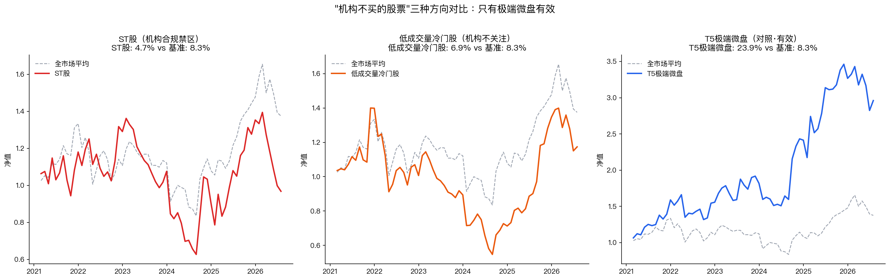

## 五、高股息填权：有税收优势但赚得不多

A股有一个制度性的"散户红利"：持股超过一年的分红免个人所得税，而机构需要缴企业所得税。逻辑上，散户可以在分红除权日附近买入高分红股票，等股价回升（"填权"）赚取这个税收优势带来的超额收益。

这次拉取了467只A股、2020年至今2943次除权事件的数据，用沪深300指数做基准来算超额收益。

在除权日买入，持有60天后：平均赚3.19%，比同期大盘多涨2.79%。2943次除权事件中，80%在60天后真的填权了（涨回了除权前的价格）。

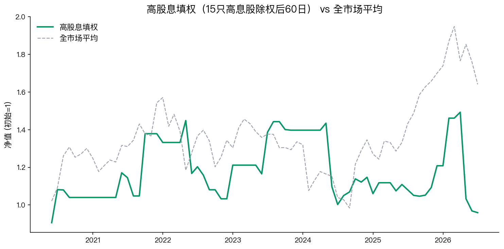

持有时间越长，填权概率越高：5天只有52%填权，20天升到69%，60天到80%，120天到86%。但超额收益始终很小——60天多涨2.79%，年化下来也就多几个点，还不够覆盖高息股本身跑输大盘的幅度。

散户的分红免税优势是真实的，但这个优势太小了——不足以单独成为一个策略。

## 六、策略轮动为什么又失败了

[而我在等你（245赞）](https://www.zhihu.com/question/529408913/answer/1988384244175749780)说他认识的成功个人量化者都有一个共同特点：策略组合积累，每个都不复杂，打通了就赚钱。用一个朴素的逻辑来想：行情好的时候拿微盘股冲，行情差的时候切国债防守——比傻拿着强。

Hermes 测试了用市场波动率作为切换信号的方案。当股市波动变大（意味着风险加剧），把微盘股的仓位换成国债；当波动降下来，再切回来。

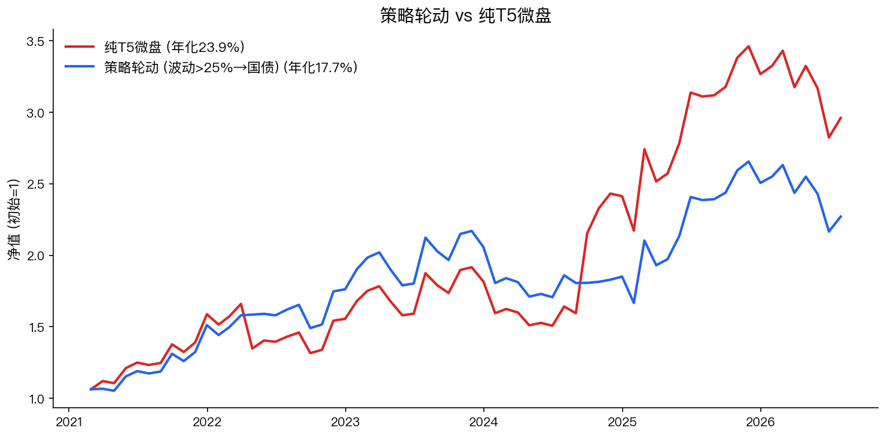

四档阈值全试了。结果最好的一档每年赚33.7%，比纯微盘股的35.68%还是少了2%。差的那档因为切得太频繁，66个月里有37个月在抱国债，每年只赚5.6%。

这个规律在我200多个策略变体中反复出现过：任何"判断时机"的策略在A股都很吃力。不是因为信号不准，而是因为躲过下跌的同时你也会躲过上涨，而后者的代价更大。A股的特点是政策市——一个政策出来大盘拉5%，你的择时模型不可能预判到这个。

不择时，但做固定配置，效果反而可以。比如把一半钱放微盘股、一半放国债，每年赚19.1%，回撤降到-14.7%，夏普比率0.97——比自己瞎判断什么时候该持有什么时候该防守强多了。

## 七、总结

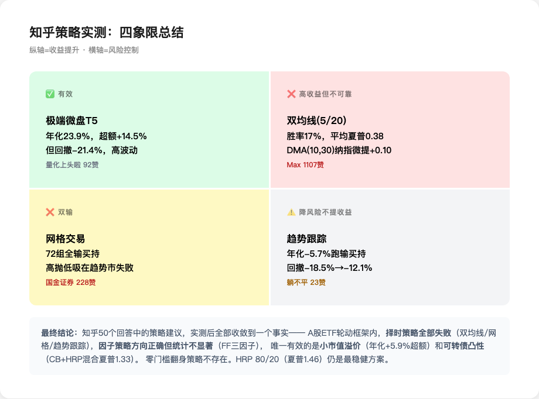

Hermes 跑了200多组回测之后，把它认为最有意思的几个发现整理了出来：

**第一条：散户唯一稳定跑赢的方向，是去机构因为规模进不去的地方，而且越极端越好。**

选5只年化35.68%，选10只降到26.40%，选20只只有20.70%且回撤反而更大（-29.1%）。所以不是"小盘股"都好——只有最微小的那几只有超额，再多就是添乱。

但这不是"躺赚"。回撤-33.3%，月度波动大，很多月份是亏钱的。少数爆涨的月份贡献了大部分收益。你需要的是持有能力和心理承受力——能够看着账户跌三分之一还继续每月调仓。

如果你接受不了这个波动：
- 一半微盘股+一半国债：年化19.1%，回撤-14.7%（比纯微盘稳，但收益少了16个百分点）

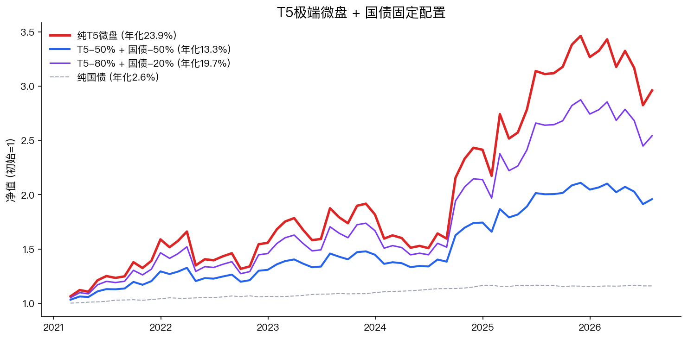
- 可转债等权/CB-HRP混合策略（层次风险平价，一个自动分散配置的方法）：OOS年化6.62%，夏普0.59，回撤-15.7%（我跑过的200多个策略里，这个是最稳的）
